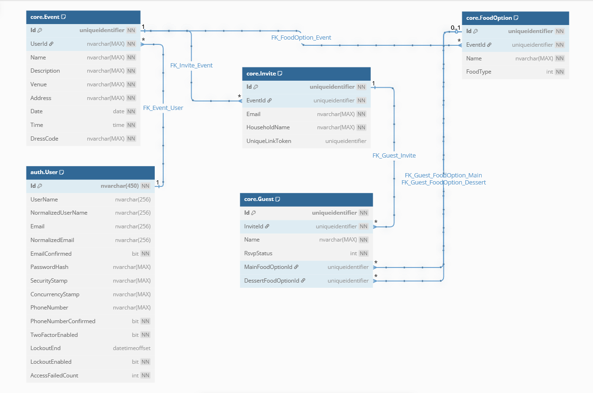
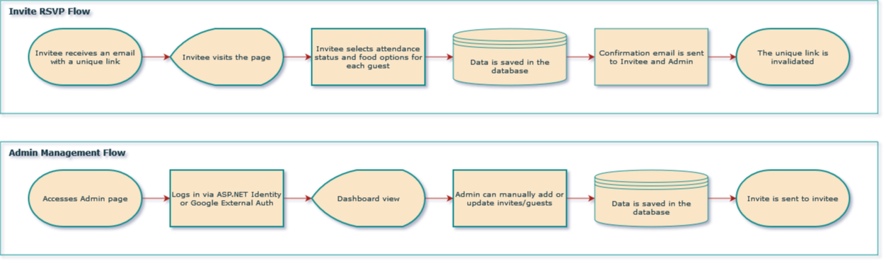

# Wedding RSVP

A modern wedding invitation and RSVP management system built with .NET 9, React, and ASP.NET Identity.

## High-Level Architecture

- Frontend: React (with Material UI Component Library)
- Backend: .NET 9 Minimal API with ASP.NET Identity
- Database: SQL Server
- Authentication: ASP.NET Identity for Invitees + Google Auth for Admin
- Hosting: Budget-friendly cloud provider (e.g., DigitalOcean, Linode, or AWS - Lightsail)
- Email Provider: SendGrid, Mailgun, or Amazon SES (cost-effective options)

## Database Schema

- Event

  - Id (GUID, PRIMARY KEY)
  - Name (NVARCHAR)
  - Description (NVARCHAR)
  - Venue (NVARCHAR)
  - Address (NVARCHAR)
  - Date (DATETIME)
  - Time (Time)
  - DressCode (NVARCHAR)

- FoodType

  - Id (GUID, PRIMARY KEY)
  - Name (NVARCHAR, UNIQUE)

- FoodOption

  - Id (GUID, PRIMARY KEY)
  - FoodTypeId (GUID, FOREIGN KEY)
  - Name (NVARCHAR)

- EventFoodOption

  - Id (GUID, PRIMARY KEY)
  - EventId (GUID, FOREIGN KEY)
  - FoodOptionId (GUID, FOREIGN KEY)

- Invite

  - Id (GUID, PRIMARY KEY)
  - EventId (GUID, FOREIGN KEY)
  - Email (NVARCHAR, UNIQUE)
  - HouseholdName (NVARCHAR)
  - UniqueLinkToken (GUID, NULL)

- RsvpStatus

  - Id (GUID, PRIMARY KEY)
  - Name (NVARCHAR, UNIQUE)

- Guest

  - Id (GUID, PRIMARY KEY)
  - InviteId (GUID, FOREIGN KEY)
  - Name (NVARCHAR)
  - RsvpStatusId (GUID, FOREIGN KEY)
  - MainFoodOptionId (GUID, FOREIGN KEY, NULL)
  - DessertFoodOtionId (GUID, FOREIGN KEY, NULL)

- ApplicationUser

  - Id (GUID, PRIMARY KEY)
  - Email (NVARCHAR, UNIQUE)

## API Endpoints

### Authentication

- `POST /api/auth/login` (For Admin using Google Auth)
- `POST /api/auth/logout`

### Invitee Actions

- `GET /api/invite/{token}` → Validate token & return event details
- `POST /api/invite/{token}/submit` → RSVP submission

### Admin Actions (Protected)

- `GET /api/admin/invitees` → List all invitees
- `POST /api/admin/invitee` → Create new invitee (sends email)
- `PUT /api/admin/invitee/{id}` → Update invitee details
- `DELETE /api/admin/invitee/{id}` → Remove invitee
- `GET /api/admin/event/{id}` → View event details
- `PUT /api/admin/event/{id}` → Update event details

## Frontend Pages

### Public

- Landing Page: Allows admin login.
- Invite Page: Accessed via a unique link; pre-authenticated.

### Admin (Protected)

- Dashboard: View RSVP summary (Attending, Not Attending, Awaiting Response).
- Manage Invitees: Add, update, remove invitees.

## Workflow

### Invitee RSVP Flow

- Invitee receives an email with a unique link.
- They visit the page, select attendance status, food options, and dietary - restrictions.
- Upon submission:
  - Data is saved in the database.
  - A confirmation email is sent to both the user and admin.
  - The unique link is invalidated.

### Admin Management Flow

- Logs in via Google.
- Views RSVP list & food preferences.
- Can manually add or update invitees (triggers an email to the invitee).

